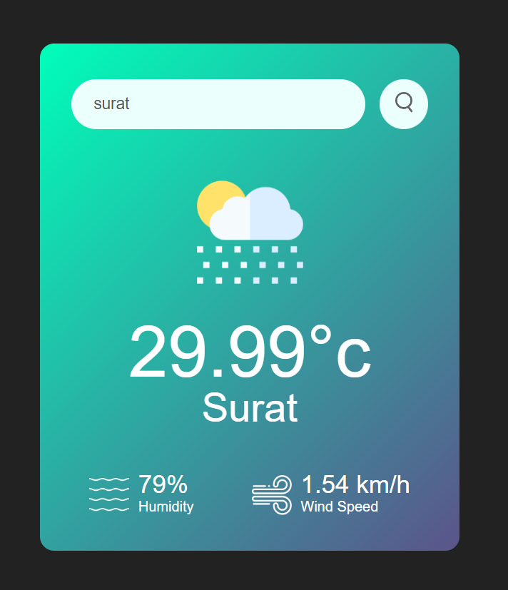

# Weather App

This repository contains the source code for a simple weather application. The application fetches and displays the current weather information for a specified city using the OpenWeatherMap API.

## Features

- **City Search:** Enter the name of a city to get the current weather data.
- **Weather Details:** Displays temperature, humidity, wind speed, and weather conditions.
- **Error Handling:** Shows an error message if the entered city name is invalid.
- **Responsive Design:** Optimized for both desktop and mobile views.

## Technologies Used

- HTML
- CSS
- JavaScript
- OpenWeatherMap API

## Project Structure

- `index.html`: The main HTML file that structures the webpage.
- `style.css`: The CSS file for styling the webpage.
- `sc.js`: The JavaScript file that handles the weather data fetching and DOM manipulation.
- `images/`: A directory containing images used in the application (e.g., weather icons).

## Getting Started

### Prerequisites

You need a web browser to run this application and an active internet connection to fetch weather data from the OpenWeatherMap API.

### Installation

1. Clone the repository:
   ```bash
   git clone https://github.com/your-username/weather-app.git
   
2. Navigate to the project directory:
   ```bash
   cd weather-app

## Usage
1. Open index.html in your web browser.
2. Enter the name of a city in the search box and click the search button.
3. The current weather details for the entered city will be displayed.

## API Key
The application uses the OpenWeatherMap API to fetch weather data. Replace the apiKey variable in sc.js with your own OpenWeatherMap API key:
```javascript
const apiKey = "your-api-key-here"
```


## Screenshots

*Before Search*


---

*After Search*




## Contributing
Feel free to submit issues or pull requests if you find any bugs or have suggestions for improvements.


